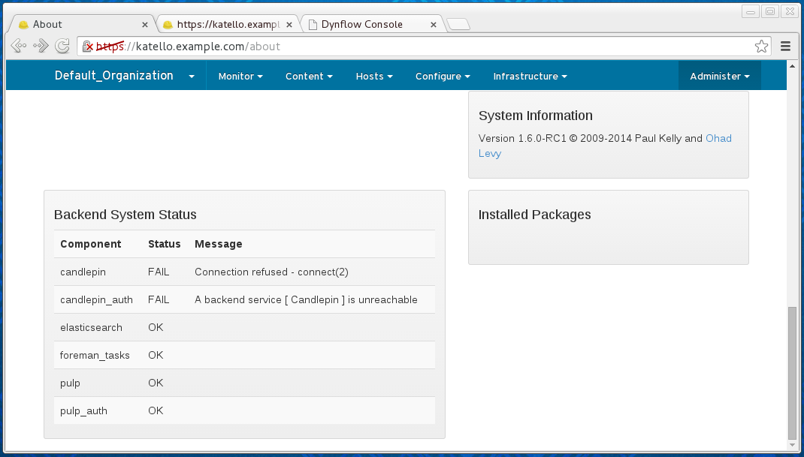
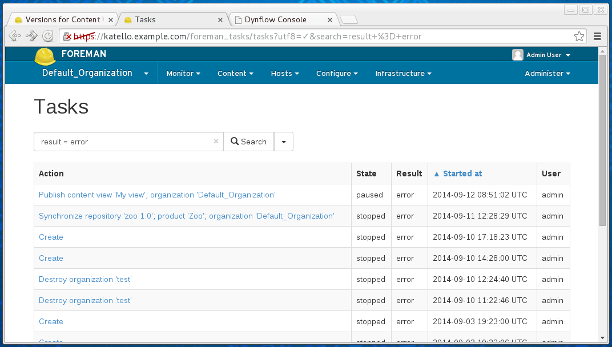
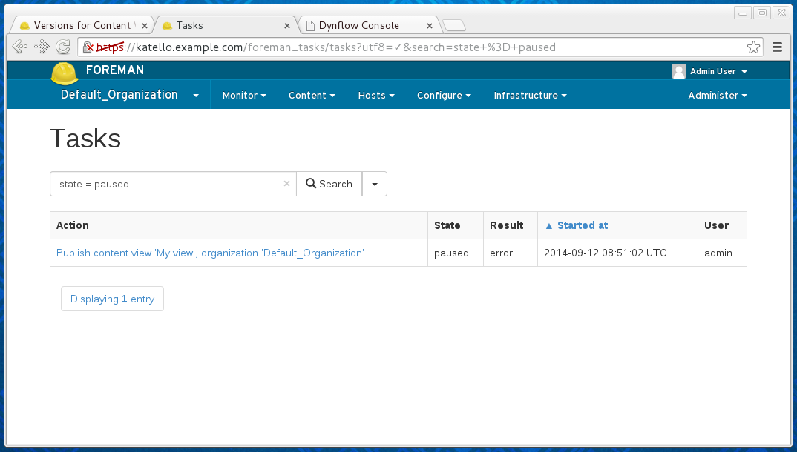
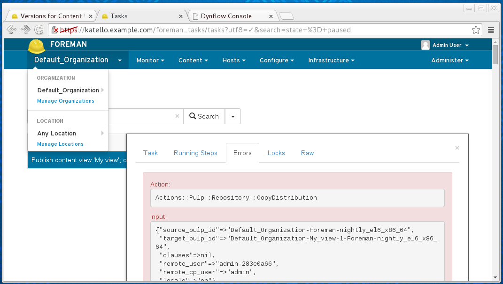
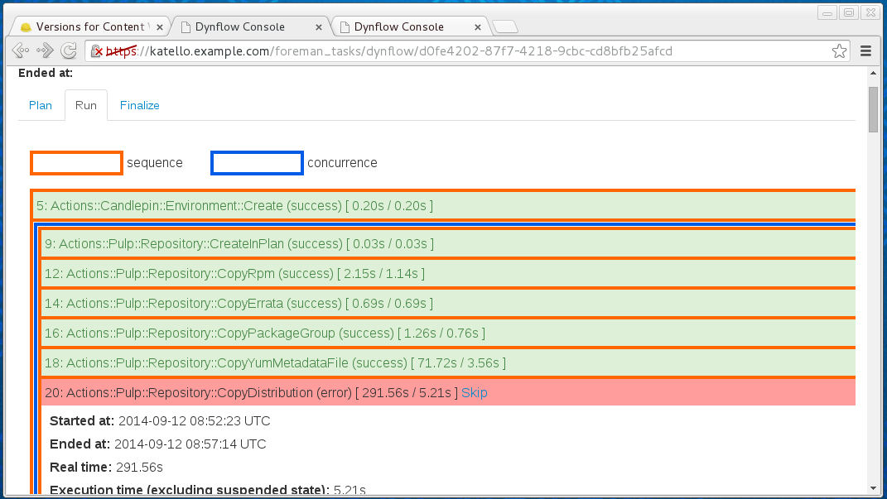
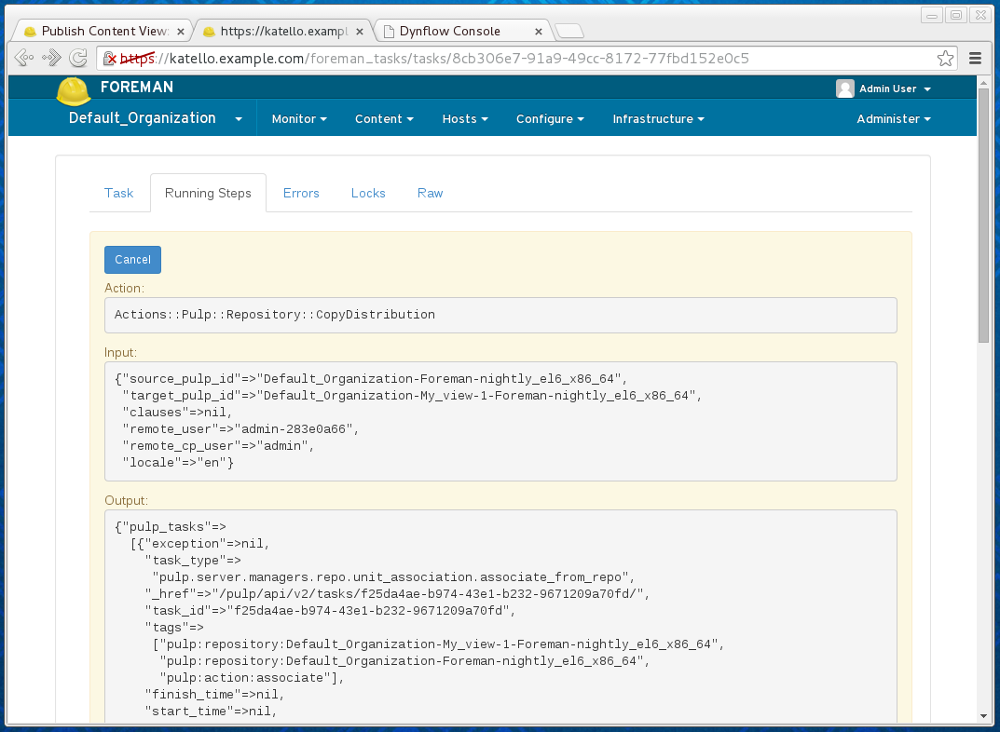
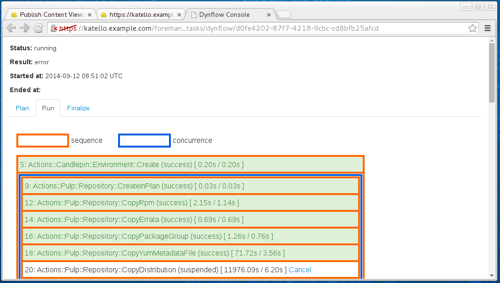
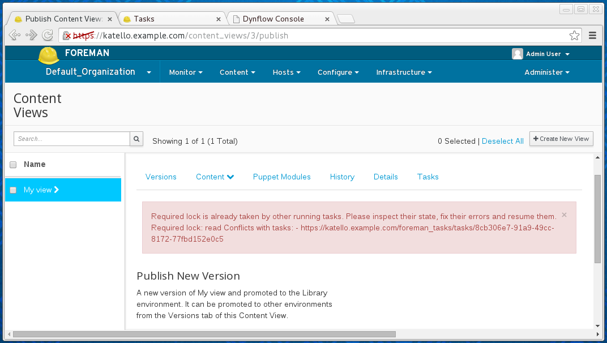

# Troubleshooting

## Sub-services status

Katello uses a set of back-end services to perform the actual job. The status of these services can negatively influence the whole system and it's one of the first things to check when some errors occur.

The status of back-end services can be found either from the Web UI on the ``/about`` page:

Alternatively, the ``hammer ping`` command can be used to get this information.

``katello-service`` tool can be used to restart Katello related services. See ``man katello-service`` for more details.

## Logs

There are multiple log files with potentially valuable data for debugging. The `foreman-debug` tool can be used to collect these files for further investigation. See `man foreman-debug` for more details.

## Tasks

Katello uses [Foreman Tasks](https://github.com/theforeman/foreman-tasks) for orchestration between the underlying services (local database, Pulp, Candlepin…). The tasks are modeled as [Dynflow](https://github.com/Dynflow/dynflow) processes. When something goes wrong (and there might be many reasons for this happening), Dynflow gives us the tools to recover from these errors to get to the consistent state.

### Health checking

There are two properties used for identifying issues with a task:

- **state** - what phase of execution is the task in, possible values are:
  - **planning** - the planning phase of the task is performed: the operations performed in this phase shouldn't modify anything outside Katello's database. The execution of this phase happens in the web-process thread and usually should not take more than few seconds
  - **planned** - the planning phase finished and the task is waiting for the executor process (`foreman-tasks service`) to pick it up
  - **running** - the executor is performing the orchestration action, modifying the state of external services to converge to the final state
  - **paused** - something went wrong during running the task and it's waiting for the resolution (further details below)
  - **stopped** - the execution of the task finished (the success is determined by the **result** value
- **result** - how the task ended up (or is going to end up if we already know it
  - **pending** - it's not clear yet if the task is successful or some error is there
  - **success** - no errors occurred during the execution
  - **error** - unresolved errors occurred during the execution
  - **warning** - there were errors during the execution, but they haven't prevented from the task to finish or were skipped manually (further details below).

To see all the tasks in the system, one can go to ``/foreman_tasks/tasks`` page. To see all the tasks that failed, one can search on `result = error`:

There are tasks both in state 'stopped' and 'paused'. The stopped ones are already considered as resolved (in terms of no risk inconsistency). The tasks in 'stopped' state and 'error' result are usually those failed in planning phase (usually locking error or bad input data).

To see all the tasks requiring further assistance, filter on ``state = paused``:

### Dealing with paused task

Once the paused task is identified, one can investigate the error causing the errors:

The further steps are dependent on the error details. One of the preferred options is to resume the task: sometimes, the issue can get resolved just on retrying the task, maybe while making sure the sub-services are running (see [Sub-services status](#sub-services-status) for more details).

If this still doesn't help, one possible step is going to a Dynflow console (the button from task details takes you there):

**Caution: Dynflow console is considered a low-level tool and should be used very carefully, ideally discussing other resources first before using its features**

If the failed task was taken care of by other means (performing the failed steps manually) or it was identified as not critical to the whole task, one can ``skip`` the failed step and ``resume`` the task to continue. These tasks end up with `warning` result at the end, to indicate there was some difficulty during the run.

### Dealing with tasks running too long

In came cases, there might be an issue with sub-services that makes it appear as the task is running too long, without any obvious evidence that something is occurring withing the task.

The first place to look in this case is filtering the tasks on ``state = running`` and looking at `Running Steps` in the task details:

In this case, the ``"start_time" => nil`` indicates that the task was not picked up by Pulp, which usually means some issues with running the Pulp workers. See (see [Sub-services status](#sub-services-status) for more details).

One can also go to the Dynflow console for even more details: the ``suspended`` state means that the step is waiting for the external task to finish - the ``suspended`` state itself doesn't have to indicate any error:

If you're sure the underlying services are running fine, depending on the type of task, there might be a possibility to cancel the running step and possibly following [dealing with paused tasks](#dealing-with-paused-task) instead.

### Locking

Foreman tasks provides a locking mechanism which is important to prevent possibly colliding operations to be performed concurrently on the same resource (such as synchronizing and deleting a repository at the same time).

When trying to run an operation on a resource that another task is already running, one can get ``Required lock is already taken by other running tasks.``:

This means some other task is related to the same resource as the task one tries to start and the other task is **in running or paused state**. That means that the error is triggered also in cases, where there is a task with unresolved failure (see [dealing with paused tasks](#dealing-with-paused-task) for more details).

In rare cases, it might be hard to get into the stopped state. There is a possibility to unlock the resource in the ``running``/``paused`` task. This will switch the task into ``stopped`` state, freeing the resources for other tasks.  **Caution: unlocking allows running other tasks to run on potentially inconsistent data, which might lead into further errors**. It's still possible to go to the Dynflow console and resume the tasks, even after using the unlock feature. There are two unlock-related buttons:
``Unlock`` and ``Force Unlock``. The only difference between these two is the second one is allowed even when the task is in ``running`` state, and therefore is potentially even  more dangerous than the ``Unlock`` button. See [dealing with tasks running too long](#dealing-with-tasks-running-too-long) before attempting to use the ``Force Unlock`` option.
